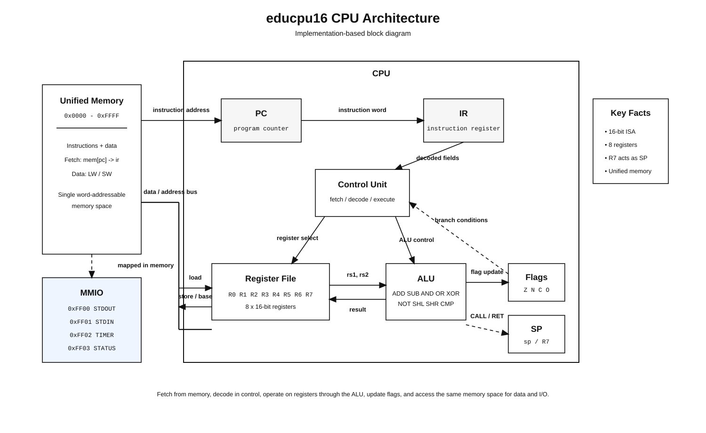
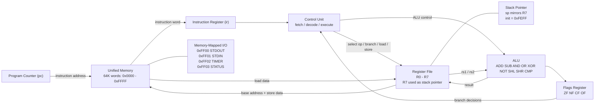

# educpu16 — A 16-Bit Software CPU

A complete software CPU implemented in C, including a two-pass assembler, a cycle-accurate emulator with memory-mapped I/O, and three assembly programs that run on it end-to-end.

## Demo Video

Google Drive Link: [Watch the demo](https://drive.google.com/file/d/1pPRM6jjPZEVv7ONwJN2HXCZpQcDIIZ2Q/view?usp=sharing) 


## Repository Structure

```
educpu16/
  assembler/            Two-pass assembler (lexer, parser, encoder, symtable)
    isa.h               Shared ISA contract — opcodes, formats, memory map
  emulator/             CPU emulator (ALU, control unit, memory, MMIO)
  programs/             Assembly programs
    timer_example.asm   Fetch/Compute/Store cycle using the hardware timer
    hello.asm           Prints "Hello, World!" via memory-mapped I/O
    fibonacci.asm       Computes the first 10 Fibonacci numbers
  tests_assembler/      Encoder unit tests
  tests_emulator/       ALU unit tests and FDE integration tests
  tests_programs/       End-to-end program tests
  Makefile              Builds the emulator; runs all test suites
  Makefile_assembler    Builds the assembler
```

## CPU Schematic

<p align="center">
  
</p>
<p align="center"><em>Figure 1: educpu16 CPU architecture (block diagram).</em></p>


<p align="center"><em>Figure 2: educpu16 CPU architecture.</em></p>

## Prerequisites

- A C11 compiler: `gcc` or `clang` (`cc` on macOS)
- GNU `make`
- `bash` (for the end-to-end test script)
- Windows users: WSL or Git Bash required to run the test script and Makefile

No third-party libraries required.

## Build

**Assembler:**
```bash
make -f Makefile_assembler all
```
Produces `./assembler_bin`.

**Emulator:**
```bash
make
```
Produces `./emulator_bin`.

## Test Suite

Run all tests with a single command:

```bash
make -f Makefile_assembler test   # assembler encoder round-trip tests
make test                         # ALU unit tests + FDE integration tests + program end-to-end tests
```

Expected output:
```
all encoder round-trip tests passed
all emulator ALU tests passed
all emulator integration tests passed

educpu16 — end-to-end program tests
======================================

[ timer_example ]
  PASS  assembles without error
  PASS  emulator exits cleanly
  PASS  result written to 0x0200 ...

[ fibonacci ]
  PASS  assembles without error
  PASS  emulator exits cleanly
  PASS  first 8 terms correct at 0x0300 (0,1,1,2,3,5,8,13)
  PASS  last 2 terms correct at 0x0308 (21,34)

[ hello ]
  PASS  assembles without error
  PASS  emulator exits cleanly
  PASS  stdout is exactly 'Hello, World!'

======================================
10 / 10 tests passed
all program tests passed
```

## Programs

Assemble a program and run it:

```bash
./assembler_bin programs/<name>.asm -o <name>.bin
./emulator_bin  <name>.bin [flags]
```

### timer_example

Reads the hardware timer (`IO_TIMER = 0xFF02`), adds 42, stores the result at `0x0200`.
Demonstrates a single Fetch / Compute / Store cycle.

```bash
./assembler_bin programs/timer_example.asm -o timer_example.bin
./emulator_bin  timer_example.bin --dump --addr 0200
```

The first word at `0x0200` contains `timer_value + 42`.

### hello

Prints `Hello, World!` to the console by writing each character to the memory-mapped stdout port (`IO_STDOUT = 0xFF00`).

```bash
./assembler_bin programs/hello.asm -o hello.bin
./emulator_bin  hello.bin
```

### fibonacci

Computes `F(0)` through `F(9)` and stores each value in RAM starting at `0x0300`.

```bash
./assembler_bin programs/fibonacci.asm -o fibonacci.bin
./emulator_bin  fibonacci.bin --dump --addr 0300
```

Expected output:
```
0300: 0000 0001 0001 0002 0003 0005 0008 000D
0308: 0015 0022 ...
```
In decimal: `0, 1, 1, 2, 3, 5, 8, 13, 21, 34`

## Emulator Flags

| Flag | Effect |
|------|--------|
| `--trace` | Print full CPU state after every instruction |
| `--step` | Interactive single-step mode (press Enter to advance) |
| `--dump` | Hex dump a memory region after the program halts |
| `--addr 0xXXXX` | Start address for `--dump` (default `0x0000`) |

Assembler flag:

| Flag | Effect |
|------|--------|
| `--listing` | Print address, encoded word, and source line for every instruction |
| `--symbols` | Print the symbol table after assembly |

## ISA Overview

All instructions are 16-bit words. Three formats:

| Format | Layout | Used by |
|--------|--------|---------|
| R | `op[15:11] rd[10:8] rs1[7:5] rs2[4:2] func[1:0]` | ADD, SUB, AND, OR, XOR, NOT, SHL, SHR, CMP |
| I | `op[15:11] rd[10:8] rs1[7:5] imm5[4:0]` | ADDI, LW, SW, MOV |
| J | `op[15:11] offset11[10:0]` | JMP, JEQ, JNE, JLT, JGT, CALL |

Registers: `R0`–`R7` (8 general-purpose, 16-bit). `R7` doubles as the stack pointer.

Memory-mapped I/O ports:

| Address | Port |
|---------|------|
| `0xFF00` | `IO_STDOUT` — write a character to stdout |
| `0xFF01` | `IO_STDIN` — read a character from stdin |
| `0xFF02` | `IO_TIMER` — read the current timer tick |
| `0xFF03` | `IO_STATUS` — reserved/status-mapped address in ISA |
| `0xFEFF` | `STACK_BASE` — initial stack pointer |
