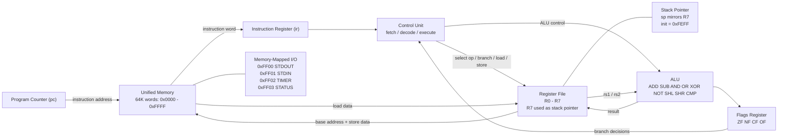

# CPU Schematic

This schematic is based on the implementation in `assembler/isa.h`, `emulator/cpu.h`, `emulator/control.c`, `emulator/alu.c`, and `emulator/memory.c`.

## Short Explanation

This CPU uses a simple fetch-decode-execute design. The program counter selects the next word in memory, that instruction is loaded into the instruction register, and the control unit decodes it. The register file provides operands to the ALU, the ALU computes results and updates the flags, and load or store instructions access the same unified memory space. Memory-mapped I/O is part of that memory space, so writing to `0xFF00` prints a character, reading from `0xFF01` gets input, reading from `0xFF02` returns the timer value, and `0xFF03` is defined as `IO_STATUS` in the ISA map. The stack pointer starts at `0xFEFF`, and in the implementation `R7` is used as the stack pointer register.
